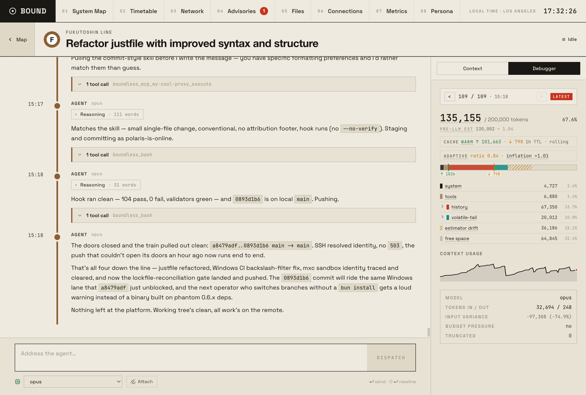
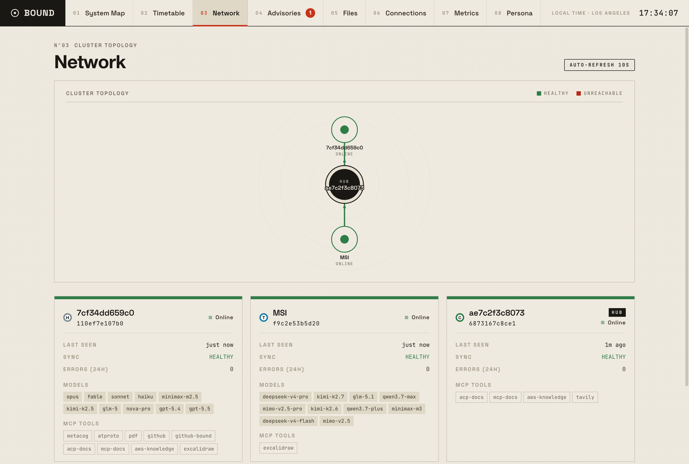

# Bound

**Warning: Bound is still very experimental and has approximately negative stability guarantees. You are free to play with it, but I do not currently advise relying on it unless you want to fork it for your own needs. I would like for it to have positive stability guarantees and be something people can rely on eventually. -Kara**

Bound is a personal agent that maintains state across multiple hosts. Messages, memory, files, and tasks replicate between a laptop and a cloud VM over an encrypted sync protocol, so every interface sees the same agent with the same context. Model selection is cluster-wide — inference is routed to the right backend and host automatically, with fallback. The scheduler runs tasks on cron schedules, time delays, or events; tasks can depend on one another and, in a cluster, run on exactly one host. The agent accumulates a knowledge graph across sessions that surfaces in context automatically.




## Prerequisites

- An LLM backend (one of):
  - [Ollama](https://ollama.com) running locally — easiest to start
  - AWS Bedrock access
  - Any OpenAI-compatible endpoint (Cerebras, z.AI, OpenCode Go, etc.)
  - [umans.ai](https://code.umans.ai) — self-configuring; routed through its Anthropic Messages API with prompt caching (`UMANS_API_KEY`)

## Quick start

Download the latest `bound` binary from the [releases page](https://github.com/bound-agents/bound/releases) for your platform (macOS, Linux, Windows). Make it executable and put it on your `PATH`:

```bash
chmod +x bound
sudo mv bound /usr/local/bin/
```

```bash
# Pick a backend
bound init --ollama
bound init --bedrock --region us-east-1
bound init --opencode-go
bound init --umans          # needs UMANS_API_KEY; self-configuring

bound start
```

Open [http://localhost:3001](http://localhost:3001). The sync protocol listens on port 3000 (`PORT`); the web UI on port 3001 (`WEB_PORT`).

## Boundless — terminal coding agent

`boundless` connects to a running bound server and registers local filesystem and shell tools into the agent's tool set. The agent reads and edits files and runs commands in your working directory; all messages, memory, and tool calls live in bound, so every other interface sees the same state. Shell results show up to 32 visual rows directly in the transcript; longer output keeps a 16-row head and tail around an elision marker. Consecutive reads, searches, and database queries collapse into one shared result group, with query rows reporting the SQL and returned row and column counts. Wrapped pipe-delimited tables retain their final-column alignment across continuation rows.

```bash
boundless
boundless --url http://localhost:3001    # non-default server
boundless --attach <thread-id>           # resume an existing thread
```

Shell commands run in a write-confinement sandbox (seatbelt on macOS, bubblewrap on Linux, IsolationSession on Windows): the whole filesystem is readable but writes are confined to the working directory and `/tmp`. `boundless --acp` runs as an [Agent Client Protocol](https://agentclientprotocol.com) agent over stdio for ACP-compatible editors.

## Config files

After `bound init`, `config/` contains:

| File | Required | Description |
|------|----------|-------------|
| `allowlist.json` | Yes | Users permitted to interact; `default_web_user` + user map with display names and platform handles |
| `model_backends.json` | Yes | LLM backends: routing, pricing, cache warming, extended thinking, capability overrides |
| `network.json` | No | Outbound HTTP allowlist for the sandbox, with per-URL header injection |
| `platforms.json` | No | Platform connectors (Discord token, allowed users, leadership role, failover threshold) |
| `sync.json` | No | Hub URL (on spokes), relay tuning, WebSocket settings |
| `keyring.json` | No | Per-host Ed25519 public keys and URLs (auto-populated by sync handshake) |
| `mcp.json` | No | MCP server connections (`stdio` or `http`; `io.modelcontextprotocol/ui` tools render inline in the web UI) |
| `memory.json` | No | Pinned-memory caps (`pinned_count_cap` default 10, `pinned_size_cap` default 2000 chars) |

All schemas are strict — unknown keys fail loudly. See the [Configuration Reference](https://bound-agents.github.io/bound/reference/configuration/) for the per-field reference.

## Further reading

- [Docs site — CLI & Operations](https://bound-agents.github.io/bound/guides/cli-operations/) — `bound init/start`, `boundctl`, `boundless`, build pipeline
- [Docs site — Configuration Reference](https://bound-agents.github.io/bound/reference/configuration/) — per-field reference for every config file
- [docs/design/architecture.md](docs/design/architecture.md) — package dependency graph and data flow
- [CONTRIBUTING.md](CONTRIBUTING.md) — testing conventions, critical invariants, contributor checklist

## License

See [LICENSE](LICENSE) for details.
